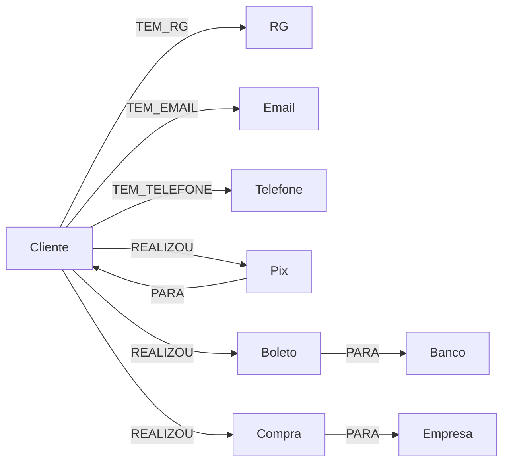

# Carga de dados relacionais no Neo4j — Workshop SECOMP

Material prático para aprender a modelar dados relacionais como um grafo e
carregá-los no Neo4j, usando um cenário de **detecção de fraude bancária
brasileira (Pix, boleto, cartão)** como fio condutor. Pensado para pouco setup e
para cada etapa ser validável sozinha: notebooks auto-guiados, do zero até a
exploração dos dados.

Inspirado no [guia oficial de detecção de fraude do
Neo4j](https://github.com/neo4j-graph-examples/fraud-detection), mas os dados são
gerados do zero (sintéticos, via Faker) para que cada execução gere sua própria
base, independente e descartável.

## Estrutura

```
workshop/
├── README.md                              # este arquivo
├── notebooks/
│   ├── 00_setup_conexao.ipynb              # testar conexão com Neo4j
│   ├── 01_gerar_dados_relacionais.ipynb    # gera as tabelas CSV com fraude injetada
│   ├── 02_modelagem_e_carga.ipynb          # núcleo do material: relacional -> grafo -> carga
│   ├── 03_cypher_basico.ipynb              # fundamentos de Cypher usando o grafo carregado
│   ├── 04_explorando_fraude.ipynb          # investigação: anéis de fraude e contas-laranja
│   ├── 05_visualizacao.ipynb               # visualiza os achados com neo4j-viz
│   └── 99_reset_base.ipynb                 # (opcional) apaga tudo para recomeçar
├── aura-agent/                             # (opcional) configuração de um Aura Agent
│   ├── README.md                           # campos e tools sugeridas
│   └── agent-config.json                   # payload pronto para a API
└── data/                                   # CSVs gerados pelo notebook 01 (git-ignorável)
```

## Pré-requisitos

- Uma conta Google (para rodar os notebooks no [Google Colab](https://colab.research.google.com/) — zero instalação local)
- Um banco Neo4j em branco (instruções abaixo — leva ~2 minutos para criar)

Nenhum conhecimento prévio de Neo4j é necessário. Ajuda ter visto o conceito de
tabelas/chave primária/chave estrangeira antes (mas o notebook 02 recapitula isso).

## Setup do banco Neo4j

O material é feito para o **AuraDB Free** de ponta a ponta — é gratuito, não pede
cartão de crédito e não expira.

1. Acesse [console.neo4j.io](https://console.neo4j.io), crie uma conta gratuita (sem cartão de crédito) e uma instância **Free**
2. Anote a **URI de conexão**, o **usuário** e a **senha** (mostrada só uma vez na criação — salve antes de fechar)
3. Anote o **instance id**: é o prefixo da URI — em `neo4j+s://dbd12345.databases.neo4j.io` o instance id é `dbd12345`
4. Anote o **nome do banco**. ⚠️ Em instâncias AuraDB recentes ele **não** é `neo4j`, e sim o próprio instance id (`dbd12345`). Confira em Aura Console → sua instância, ou rode `SHOW DATABASES`. Os notebooks perguntam esse nome

### Credenciais de API da Aura (para o notebook 04)

O notebook 04 roda WCC e PageRank através do [**Aura Graph
Analytics**](https://neo4j.com/docs/aura/graph-analytics/) — sem cobrança no tier
Free. Ele precisa de credenciais de API, que são **diferentes** da senha do banco:

1. No [Aura Console](https://console.neo4j.io), clique no seu perfil/organização (canto superior direito) → **API credentials** (ou **API Keys**)
2. **Create API credentials** → dê um nome qualquer (ex.: `workshop`)
3. Copie o **Client ID** e o **Client Secret** — o secret é exibido **uma única vez**

Notas do tier Free, verificadas na prática:

- A criação da sessão de análise leva **1–2 minutos** na primeira vez (é uma máquina sendo provisionada); a célula parece travada, mas está trabalhando
- O **TTL máximo de uma sessão é 30 minutos** — pedir mais que isso retorna erro
- Sessões nos tiers Free e Pro Trial **não são cobradas**

O notebook `00_setup_conexao.ipynb` testa a conexão **e** as credenciais de API,
para você não descobrir um problema já no meio do notebook 04.

## Rodando os notebooks

Todos os notebooks são pensados para rodar no [Google
Colab](https://colab.research.google.com/) (menu **Upload notebook**, ou suba a
pasta inteira para o Google Drive e abra por lá) ou localmente com Jupyter — não
há nenhuma dependência específica de ambiente, só `pip install` padrão feito na
primeira célula de cada notebook.

Os notebooks instalam o **`neo4j-rust-ext`** em vez do `neo4j` puro. Ele não
substitui o driver: traz o `neo4j` como dependência e troca a serialização Bolt por
uma implementação em Rust, mantendo a API idêntica (`from neo4j import
GraphDatabase`). Existem wheels pré-compilados para Linux/macOS/Windows em Python
3.10–3.14, então no Colab a instalação é instantânea, sem compilar nada. **Não
desinstale o `neo4j`** — o acelerador é um binário que vive dentro dele. O notebook
`00` imprime `RUST_AVAILABLE` para você confirmar que ativou.

### Passo a passo sugerido

1. **`00_setup_conexao.ipynb`** — crie o banco Neo4j e confirme que a conexão funciona
2. **`01_gerar_dados_relacionais.ipynb`** — gere as tabelas relacionais (CSVs) com os padrões de fraude injetados
3. **`02_modelagem_e_carga.ipynb`** — o núcleo do material: mapeamento relacional → grafo, constraints, carga em lote
4. **`03_cypher_basico.ipynb`** — aprenda a linguagem de consulta com o grafo que você acabou de montar (`MATCH`, travessias, agregação, caminhos de tamanho variável). Não fala de fraude: é só a linguagem
5. **`04_explorando_fraude.ipynb`** — a investigação: anéis de fraude e contas-laranja, com Cypher e Graph Data Science (via Aura Graph Analytics). Grava os resultados de volta no grafo, o que habilita o agente no fim
6. **`05_visualizacao.ipynb`** — veja os achados desenhados com [`neo4j-viz`](https://pypi.org/project/neo4j-viz/)

E o fecho do material: **[`aura-agent/`](aura-agent/README.md)** traz a configuração
de um [Aura Agent](https://neo4j.com/docs/aura/agents/) sobre esse mesmo grafo — 10
tools `cypherTemplate` (todas testadas) que transformam a investigação em conversa.
Duas delas consultam **os resultados dos algoritmos que o notebook 04 gravou no
grafo**, e é isso que fecha o ciclo: *"quais grupos de fraude existem?"* só tem
resposta porque o WCC deixou o `grupo_fraude` gravado lá.

E, fora da sequência: **`99_reset_base.ipynb`** apaga todos os dados, constraints e
índices, para recomeçar do zero. Útil se você mudou os parâmetros do notebook 01 ou
quer o banco vazio antes de apresentar. Por segurança, ele só apaga depois que você
trocar `CONFIRMAR = False` por `True`.

Se o público já conhece Cypher, o notebook 03 pode ser pulado sem quebrar nada —
os seguintes não dependem dele.

Cada notebook pede a URI/usuário/senha do Neo4j de novo (no Colab, cada notebook é
um kernel independente).

Senha e credenciais de API são lidas com `getpass`, então não ficam visíveis na
tela nem salvas na saída da célula.

### Antes de comitar notebooks executados

Os campos que **não** são sigilosos (URI, usuário, nome do banco) usam `input()`,
e o Jupyter grava o texto digitado na saída da célula. Ou seja: um notebook
executado e comitado expõe a URI da sua instância (que contém o instance id).

Limpe as saídas antes de comitar:

```bash
jupyter nbconvert --clear-output --inplace notebooks/*.ipynb
```

Os notebooks deste repositório já estão versionados sem saídas. E se você criou
credenciais de API só para acompanhar o material, revogue-as no Aura Console
quando terminar.

### Volumetria

O **AuraDB Free** aceita **200.000 nós e 400.000 relacionamentos**. O limite é
imposto pelo servidor: ao passar dele, a transação falha com
`You have exceeded the logical size limit of 200000 nodes in your database`.

Os valores padrão do notebook 01 (10.000 clientes, 140.000 transações) usam quase
toda essa cota — medido numa instância Free real:

| | Gerado | Cota do Free | Uso |
|---|---|---|---|
| Nós | 180.635 | 200.000 | **90%** |
| Relacionamentos | 311.823 | 400.000 | **78%** |

A margem que sobra é intencional: o notebook 04 cria relacionamentos novos
(`COMPARTILHA_IDENTIFICADOR`, `TRANSFERIU_PIX_PARA`) durante a investigação.

Tempos medidos nessa configuração (instância Free, rede doméstica):

| Notebook | Tempo |
|---|---|
| 01 — gerar CSVs | ~10 s |
| 02 — carga completa | **~80 s** |
| 03 — Cypher básico | ~13 s |
| 04 — fraude + GDS | ~110 s (dos quais ~80 s são a criação da sessão AGA) |
| 05 — visualização | ~7 s |
| 99 — reset | ~25 s |

Sobre otimizar a carga: medimos onde o tempo vai, e a resposta é útil. Das 140 mil
transações, a serialização no cliente custa ~1,7 s (ou ~0,13 s com o
`neo4j-rust-ext` — mais de 10× mais rápido, como o pacote promete); os outros ~60 s
são rede e escrita no servidor. Ou seja, trocar o driver melhora ~2% do total. O que
de fato mudou o tempo foi **aumentar o lote do `UNWIND`** de 500 para 2.000 linhas,
que ataca o gargalo real — as idas e voltas de rede.

**Para percorrer o material mais rápido** (ou se a rede estiver ruim no dia), use
`N_CLIENTES = 1_000` e `N_TRANSACOES = 15_000` na célula de parâmetros: a carga cai
para menos de 20 segundos, e todos os padrões de fraude continuam detectáveis. A
célula de estimativa do notebook 01 recalcula o uso da cota e **avisa antes** de
você gastar tempo carregando algo que não caberia.

## O modelo de dados

**Relacional (gerado no notebook 01):** quatro tabelas, no formato que um sistema
bancário real usaria.

| Tabela | Chave primária | Colunas |
|---|---|---|
| `clientes` | `cpf` | `nome`, `data_cadastro`, `rg`, `email`, `telefone` |
| `bancos` | `codigo` | `nome` |
| `empresas` | `cnpj` | `nome` |
| `transacoes` | `transacao_id` | `tipo`, `valor`, `step`, `ts`, `origem_cpf`, `destino_id` |

Cada entidade é identificada pelo documento que ela já tem no mundo real: pessoa por
**CPF**, empresa por **CNPJ**, banco por **código de compensação**.

**Grafo (resultado do notebook 02):**



(`Deposito` e `Saque` seguem o mesmo padrão de `Compra`, apontando para
`Empresa` — omitidos do diagrama por espaço.)

Três decisões de modelagem, e são elas que fazem o material funcionar:

- **Colunas de identidade "frouxa" viram nós.** `clientes.rg` deixa de ser texto
  dentro de mil linhas e passa a ser uma entidade única no grafo. Se dois clientes
  têm o mesmo RG, os dois apontam para o *mesmo nó* — o reaproveitamento deixa de
  ser coincidência de strings e se torna **estrutura**, visível sem nenhuma consulta
  de detecção. É o ponto central do notebook 02.
- **Mas CPF e CNPJ ficam como propriedade.** São validados e únicos por construção:
  ninguém abre duas contas com o mesmo CPF, então "quem mais usa este CPF?" não é
  pergunta que se faça. Já o RG não tem unicidade nacional e quase nunca é validado
  no cadastro — é nele que a fraude de identidade se instala. A regra que o material
  ensina: **vire nó o atributo sobre o qual você quer perguntar "quem mais se conecta
  a ele"**; o resto é propriedade.
- **A chave estrangeira polimórfica desaparece.** `transacoes.destino_id` aponta
  para três tabelas diferentes conforme o `tipo`, algo que SQL não consegue garantir
  com integridade referencial. No grafo, `(t)-[:PARA]->(destino)` funciona igual
  para `Cliente`, `Banco` ou `Empresa` — o nó carrega seu próprio label.
- **O `tipo` da transação vira label, não propriedade** — cada nó carrega duas
  labels ao mesmo tempo (`:Transacao:Pix`), do mesmo jeito que o dataset original
  do guia de detecção de fraude do Neo4j modela
  `CashIn`/`CashOut`/`Payment`/`Debit`/`Transfer`.

## Fraude injetada

O notebook 01 injeta de propósito:

- **Anéis de fraude**: grupos de 3 a 6 clientes, cada um com **CPF próprio e
  válido**, compartilhando o mesmo RG, e-mail ou telefone
- **Contas-laranja**: um representante de cada anel envia Pix repetidos, em
  valores altos, para um pequeno grupo de clientes — o padrão mais comum de golpe
  de Pix no Brasil

O gabarito completo (quem são os fraudadores e as contas-laranja) fica salvo em
`data/gabarito.json`, usado nas últimas seções do notebook 04 para comparar com o
que foi descoberto via Cypher/GDS.

## Créditos

Cenário e esquema de dados inspirados no [Neo4j Fraud Detection
Example](https://github.com/neo4j-graph-examples/fraud-detection) (dataset
PaySim), adaptado para tipos de transação brasileiros. Dados 100% sintéticos,
gerados com [Faker](https://faker.readthedocs.io/). Visualização com
[`neo4j-viz`](https://pypi.org/project/neo4j-viz/); Graph Data Science via
[Aura Graph Analytics](https://neo4j.com/docs/aura/graph-analytics/) e
[`graphdatascience`](https://pypi.org/project/graphdatascience/).
